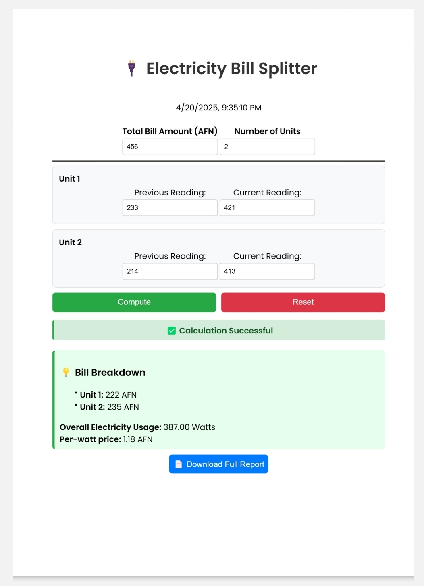
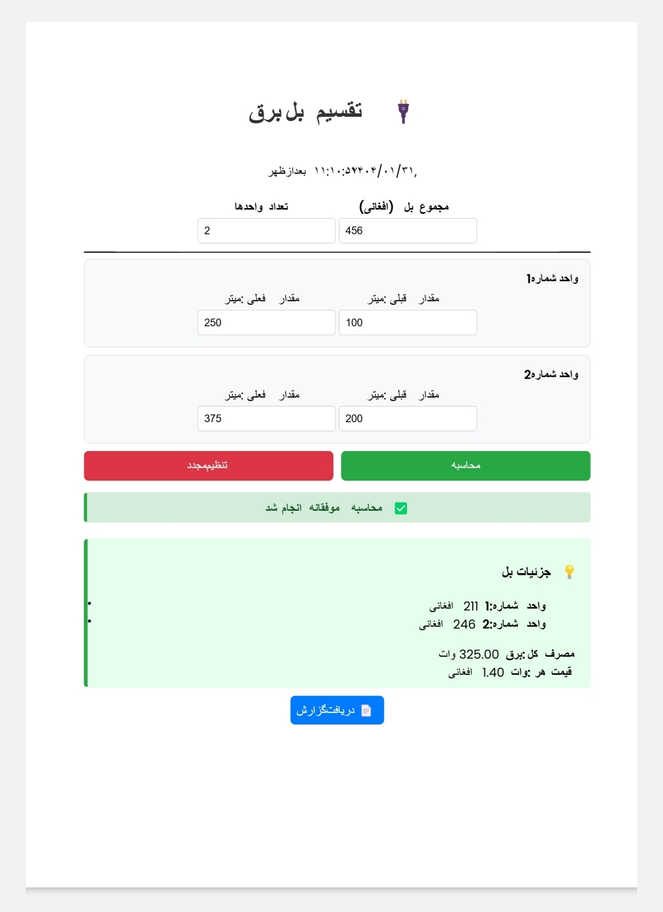

# 🔌 Electricity Bill Splitter

A lightweight and responsive web application to fairly split electricity bills among multiple units or apartments based on their individual usage.

This app is currently available in **two languages**: **Dari** and **English**, and localization support will be integrated in future versions for smoother language switching.

---

## Table of Contents

- [Features](#features)
- [Getting Started](#getting-started)
- [Usage](#usage)
- [Screenshots](#screenshots)
- [Project Structure](#project-structure)
- [Author](#author)
- [License](#license)

---

## Features

- 🧮 Calculates per-unit bill based on electricity consumption
- 📅 Real-time Afghanistan date and time display
- 📊 Summary of overall and per-unit usage and cost
- ✅ Status badge for successful computation
- 📄 Downloadable PDF report
- 🌐 Supports English and Dari versions
- 📱 Mobile-friendly and responsive UI
- 💻 Built using HTML, CSS, and Vanilla JavaScript

---

## Getting Started

### Installation

1. Clone this repository to your local machine:

   ```bash
   git clone https://github.com/m-zahir-akbari/electricity-bill-splitter.git
   cd electricity-bill-splitter
   ```

2. Open either version (`index.html`) in your browser:
   - `English/index.html`
   - `Dari/index.html`

✅ No server or setup required.

---

## Usage

1. Access **Dari** version through this link: 'https://ebs-zahir-baran.vercel.app'
2. Access **English** version through this link: 'https://ebs-zahir-baran-en.vercel.app'
3. Enter the total bill amount (in AFN).
4. Enter the number of units (apartments).
5. For each unit, input the previous and current meter readings.
6. Click **Compute** to calculate the usage and costs.
7. If everything is valid, you'll see a success badge and the option to download a PDF report.

---

## Screenshots

- **English UI**  
  

- **Dari UI**  
  

---

## Project Structure

```
electricity-bill-splitter/
├── Dari/
│   ├── index.html         # Dari version of the interface
│   ├── style.css          # Dari-specific styles
│   ├── script.js          # Logic in Dari
│   └── screenshot.png     # Dari screenshot

├── English/
│   ├── index.html         # English version of the interface
│   ├── style.css          # English-specific styles
│   ├── script.js          # Logic in English
│   └── screenshot.png     # English screenshot

└── README.md              # This documentation file
```

---

## Author

Created with ❤️ by **Mohammad Zahir Akbari**  
📍 Based in Afghanistan  
💬 Passionate about technology, Web App & Mobile App Development, and clean user experience  
🔗 [GitHub](https://github.com/m-zahir-akbari)
🔗 [LinkedIn](https://linkedin.com/in/m-zahir-akbari786)

---

## License

This project is licensed under the [MIT License](LICENSE).
You may use, modify, and distribute it with proper attribution.

---
